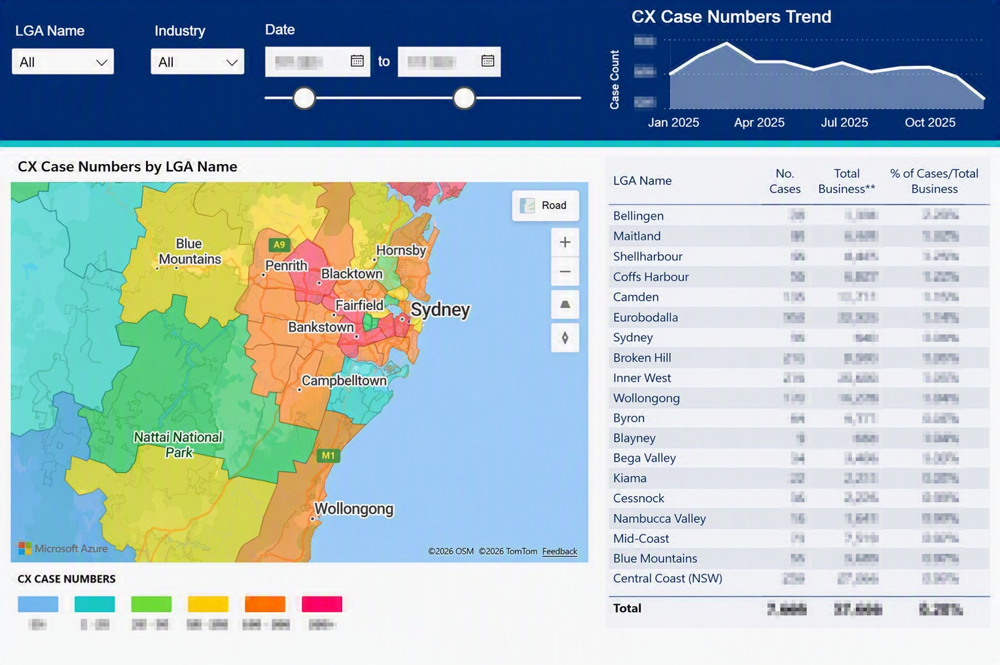
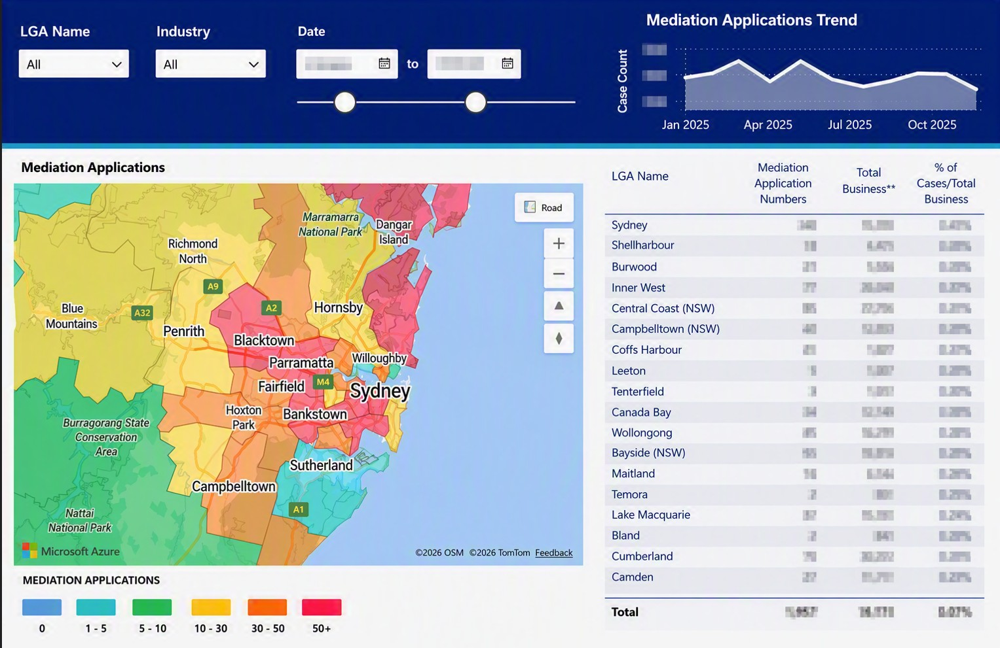
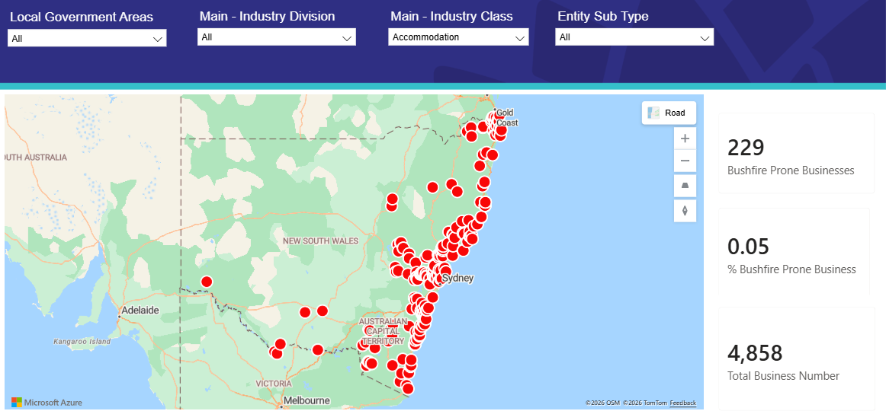
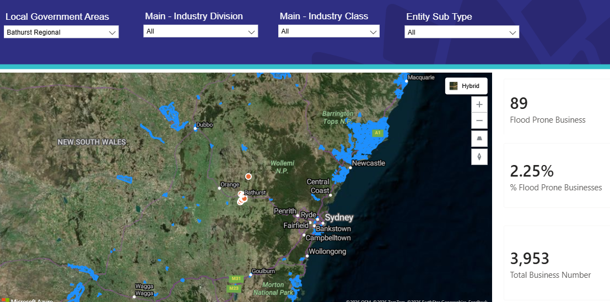

# Power BI & Business Intelligence Portfolio Projects

Welcome to my Power BI & Business Intelligence Portfolio! This repository showcases dashboards built across IT asset management, mobile fleet governance, and geographic business/risk mapping for enterprise and NSW Government stakeholders. Each project demonstrates the full workflow from raw data through cleaning, modelling, DAX, and visualisation to business insight.

## Table of Contents

- [Project 1: Laptop Asset Lifecycle & Warranty Management](dashboards/laptop-asset-lifecycle)
- [Project 2: Mobile Fleet Management](dashboards/mobile-fleet-management)
- [Project 3: Business Case & Mediation Mapping (LGA)](dashboards/business-case-mapping)
- [Project 4: Business Risk Mapping — Bushfire & Flood Prone Businesses (ABN)](dashboards/flood-prone-business-mapping)

---

**©2026 Mohammad Emran. All rights reserved.**

---

## [Project 1: Laptop Asset Lifecycle & Warranty Management](dashboards/laptop-asset-lifecycle)

Tracks warranty status, replacement cost exposure, and onboarding/replacement request volume across a large enterprise laptop fleet (400+ devices). Built while managing IT assets for 13,000+ employees across NSW Government agencies. Full README, DAX measures, Power Query steps, and synthetic sample data in the [project folder](dashboards/laptop-asset-lifecycle).

##### Preview

## [Project 2: Mobile Fleet Management](dashboards/mobile-fleet-management)

Monitors mobile service usage, cost by carrier, and ABM/KNOX device registration compliance across an enterprise mobile fleet. Full README, DAX measures, and Power Query steps in the [project folder](dashboards/mobile-fleet-management).

##### Preview

## [Project 3: Business Case & Mediation Mapping (LGA)](dashboards/business-case-mapping)

Geographic (choropleth) view of case and mediation-application volumes by NSW Local Government Area, benchmarked against the total business population per LGA. Full README, DAX measures, and Power Query steps in the [project folder](dashboards/business-case-mapping).

##### Preview

## [Project 4: Business Risk Mapping — Bushfire & Flood Prone Businesses (ABN)](dashboards/flood-prone-business-mapping)

Maps registered NSW businesses (by ABN) located in bushfire- and flood-prone areas, filterable by LGA and industry classification, to support risk-based planning. Full README, DAX measures, and Power Query steps in the [project folder](dashboards/flood-prone-business-mapping).

##### Preview

## Skills Matrix

| Skill | Demonstrated |
|---|:---:|
| Power BI | ✓ |
| DAX | ✓ |
| Power Query (M) | ✓ |
| Data Modelling | ✓ |
| SQL | ✓ |
| Excel | ✓ |
| Data Visualisation | ✓ |
| Geospatial / Choropleth Mapping | ✓ |
| IT Asset Analytics | ✓ |
| Executive Reporting | ✓ |

## Portfolio Disclaimer

Dashboard concepts, data models, and analytical logic are based on real work delivered in enterprise and NSW Government roles. Wherever the original data is confidential, synthetic data has been substituted — see the disclaimer in each project folder. No real employee names, government records, customer data, or internal system details are included anywhere in this repository.

## Contact Information

If you have any questions, feedback, or opportunities you'd like to discuss, feel free to reach out.

- **Email:** mohammademran.au@gmail.com
- **LinkedIn:** [Mohammad Emran](https://www.linkedin.com/in/mohemran/)

Thank you for visiting my portfolio!

## Author

- **Mohammad Emran** — Data Analytics & Power BI Specialist, Sydney, Australia
- **[LinkedIn](https://www.linkedin.com/in/mohemran/)**
