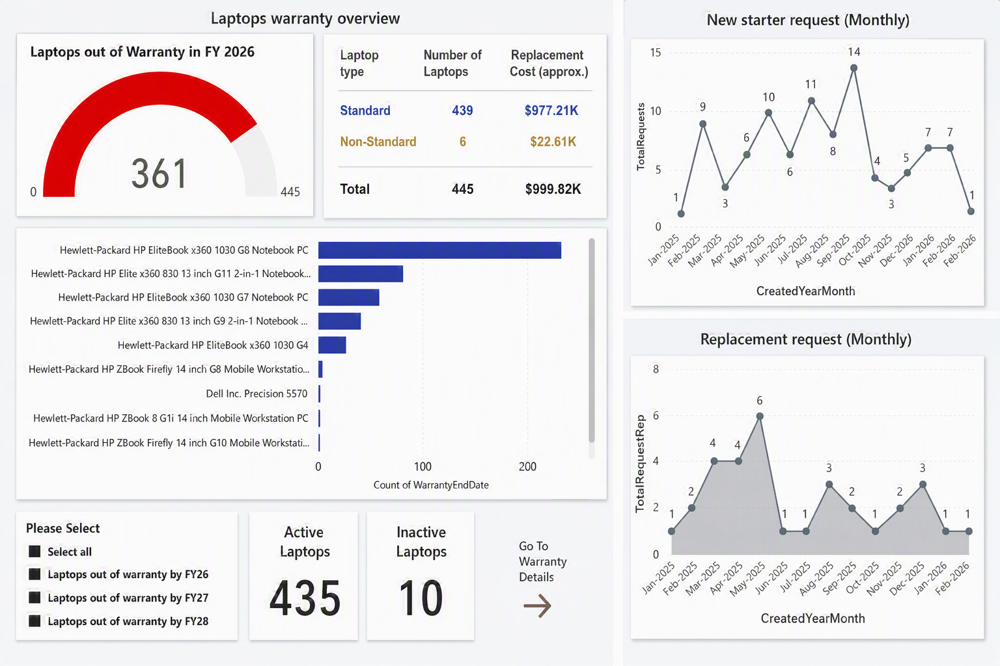

# Laptop Asset Lifecycle & Warranty Management

## Overview
A Power BI dashboard that gives IT asset managers a real-time view of laptop warranty exposure, replacement cost risk, and onboarding/replacement request volume across a large enterprise fleet.

## Business Problem
With thousands of laptops in circulation, IT teams need to know which devices are falling out of warranty, what replacing them will cost, and whether onboarding/replacement demand is trending up — without manually cross-referencing spreadsheets from multiple systems.

## Objectives
- Give visibility into warranty status across the entire laptop fleet.
- Quantify the replacement cost exposure of out-of-warranty devices.
- Track monthly new-starter and replacement request volume to support procurement planning.
- Identify which device models are driving the most warranty risk.

## Key KPIs
- Laptops out of warranty (current financial year)
- Active vs inactive laptops
- Replacement cost exposure ($) by device standard
- Monthly new-starter requests
- Monthly replacement requests

## Dashboard Features
- Gauge visual showing laptops out of warranty against total fleet size
- Cost breakdown table by laptop type (Standard / Non-Standard)
- Horizontal bar chart of warranty expiry count by device model
- Time series of monthly new-starter and replacement requests
- Slicers for warranty-expiry financial year (FY26 / FY27 / FY28)
- Drill-through to a "Warranty Details" page for a selected device

## Data Model
- **Assets** (fact): asset tag, device model, purchase date, warranty end date, status (active/inactive), assigned cost centre
- **Requests** (fact): request type (new starter / replacement), request date, device model
- **DeviceModel** (dimension): model name, manufacturer, standard/non-standard flag, unit replacement cost
- **Date** (dimension): standard calendar table with FY26/FY27/FY28 flags

Relationships: `Assets[DeviceModel]` → `DeviceModel[Model]` (many-to-one), `Assets[WarrantyEndDate]` and `Requests[RequestDate]` → `Date[Date]` (many-to-one).

## Data Preparation
Power Query steps documented in [`/power-query/laptop-asset-lifecycle.m`](../../power-query/laptop-asset-lifecycle.m):
- Merged asset export with device-model cost reference table
- Standardised device model names (trimmed manufacturer prefixes, fixed inconsistent casing)
- Calculated warranty end date from purchase date + standard warranty term per model
- Flagged Active/Inactive status based on last check-in date

## DAX
Key measures documented in [`/dax/laptop-asset-lifecycle.dax`](../../dax/laptop-asset-lifecycle.dax):
- `Laptops Out of Warranty (FY)`
- `Replacement Cost Exposure`
- `Total Requests (Monthly)`
- `% Fleet Out of Warranty`

## Dashboard Screenshots

## Insights
This dashboard lets a manager identify, at a glance, which device models are approaching end-of-life, the dollar exposure of upcoming replacements, and whether request volume is seasonal — supporting proactive procurement rather than reactive break-fix purchasing.

## Skills Demonstrated
- Power BI dashboard design
- DAX measure development
- Power Query (M) data transformation
- Data modelling (star schema)
- KPI development
- IT asset analytics
- Executive reporting

## Files
- `README.md` — this file
- `../../datasets/synthetic/laptop_assets_synthetic.csv` — synthetic asset register
- `../../datasets/synthetic/laptop_requests_synthetic.csv` — synthetic request log
- `../../dax/laptop-asset-lifecycle.dax` — DAX measures
- `../../power-query/laptop-asset-lifecycle.m` — Power Query steps
- `../../screenshots/laptop-warranty-overview.png` — dashboard screenshot

## Portfolio Disclaimer
This project is based on a real IT Asset Lifecycle dashboard built while managing IT assets for 13,000+ employees across NSW Government agencies. The screenshot above has values obscured, and the CSV files in this repository contain **entirely synthetic data** — fictional asset tags, dates, and costs — that preserve the original data model and logic without exposing any real employer or government asset records.
