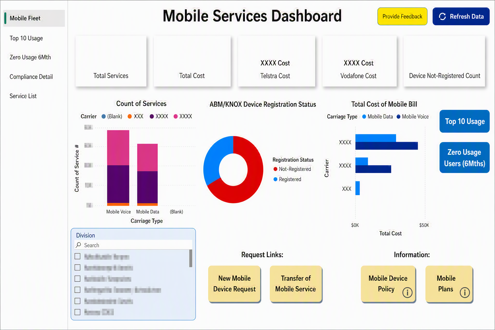

# Mobile Fleet Management

## Overview
A Power BI dashboard that tracks an enterprise mobile phone fleet — service counts, cost by carrier, and device registration compliance — to support IT asset governance and cost control.

## Business Problem
Enterprise mobile fleets span multiple carriers and plan types, and untracked devices (unregistered in ABM/KNOX) create both cost and security exposure. IT asset teams need one view to monitor usage, cost, and compliance.

## Objectives
- Track total mobile services and total mobile billing cost, split by carrier.
- Monitor ABM/KNOX device registration compliance.
- Identify zero-usage devices as candidates for decommissioning.
- Surface top-usage devices/users for cost review.

## Key KPIs
- Total services
- Total mobile bill cost (by carrier)
- Device registration rate (registered vs not-registered)
- Devices with zero usage over 6 months

## Dashboard Features
- KPI cards for total services, total cost, and cost by carrier
- Stacked bar chart of service count by carrier and carriage type (voice/data)
- Donut chart of ABM/KNOX registration status
- Horizontal bar chart of total mobile bill by carrier and carriage type
- Division-level filter/search
- Navigation buttons to "Top 10 Usage" and "Zero Usage Users (6 Months)" detail pages
- Quick-link buttons for new device requests and service transfers

## Data Model
- **Services** (fact): service number, carrier, carriage type (voice/data), monthly cost, division, registration status
- **UsageLog** (fact): service number, usage date, usage volume
- **Carrier** (dimension): carrier name, plan type
- **Division** (dimension): division name

Relationships: `Services[Carrier]` → `Carrier[Carrier]`, `Services[Division]` → `Division[Division]`, `UsageLog[ServiceNumber]` → `Services[ServiceNumber]`.

## Data Preparation
Power Query steps documented in [`/power-query/mobile-fleet-management.m`](../../power-query/mobile-fleet-management.m):
- Combined monthly carrier billing exports into a single table
- Standardised carrier names across billing files
- Joined ABM/KNOX registration export to the service list to flag registration status
- Calculated a rolling 6-month usage flag per device

## DAX
Key measures documented in [`/dax/mobile-fleet-management.dax`](../../dax/mobile-fleet-management.dax):
- `Total Mobile Cost`
- `% Devices Registered`
- `Zero Usage Devices (6 Mth)`
- `Total Services`

## Dashboard Screenshots

## Insights
The dashboard highlights which carriers and divisions are driving mobile spend, flags devices that are unregistered (a compliance/security gap), and surfaces zero-usage devices — giving IT asset managers a direct path to cost recovery and improved fleet compliance.

## Skills Demonstrated
- Power BI dashboard design
- DAX measure development
- Power Query (M) data transformation
- Cost analysis and reporting
- Compliance/governance reporting
- Dashboard UX (navigation, drill-through)

## Files
- `README.md` — this file
- `../../datasets/synthetic/mobile_services_synthetic.csv` — synthetic service/billing register
- `../../dax/mobile-fleet-management.dax` — DAX measures
- `../../power-query/mobile-fleet-management.m` — Power Query steps
- `../../screenshots/mobile-services-dashboard.png` — dashboard screenshot

## Portfolio Disclaimer
This project is based on a real mobile fleet dashboard built for an enterprise IT environment. Carrier names shown in the original are genericised, and the CSV in this repository contains **entirely synthetic data** — fictional service numbers, costs, and divisions — preserving the original data model without exposing any real billing or employee data.
